# Nginx
En este tutorial, aprenderemos a configurar un entorno de servidores web seguros y personalizados usando Nginx y Docker.

Desplegaremos varios sitios virtuales, cada uno con certificados SSL, autenticación de usuarios y páginas de error personalizadas. Al basar el entorno en contenedores Docker, lograremos una gestión modular y eficiente de la infraestructura, facilitando escalabilidad y mantenimiento.

Además, generaremos certificados SSL mediante OpenSSL, protegeremos rutas específicas con autenticación básica y usaremos comandos Docker para construir, iniciar y depurar todo el entorno.

## CONFIGURACION INICIAL
Para empezar crearemos la siguiente estructura
```
proyecto_nginx/
│
├── certs/
│
├── conf/
│   └── nginx.conf
│
├── htpasswd/
│
├── scripts/
│   └── entrypoints.sh
│
├── sites-available/
│   ├── mario.conf
│   ├── dedomingo.conf
│   └── seguro.conf
│
├── website/
│   ├── mario.com/
│   │   ├── index.html
│   │   └── error/
│   │       └── 404.html
│   │
│   ├── dedomingo.com/
│   │   ├── index.html
│   │   └── error/
│   │       └── 404.html
│   │
│   └── seguro.net/
│       ├── index.html
│       └── error/
│           ├── 401.html
│           ├── 403.html
│           ├── 404.html
│           └── 500.html
│
└── docker-compose.yml

```

Archivo principal de configuración con directivas generales, `nginx.conf`:
```
user www-data;
worker_processes auto;
pid /run/nginx.pid;
error_log /var/log/nginx/error.log;
include /etc/nginx/modules-enabled/*.conf;

events {
	worker_connections 768;
	# multi_accept on;
}

http {

	##
	# Basic Settings
	##

	sendfile on;
	tcp_nopush on;
	types_hash_max_size 2048;
	# server_tokens off;

	# server_names_hash_bucket_size 64;
	# server_name_in_redirect off;

	include /etc/nginx/mime.types;
	default_type application/octet-stream;

	##
	# SSL Settings
	##

	ssl_protocols TLSv1 TLSv1.1 TLSv1.2 TLSv1.3; # Dropping SSLv3, ref: POODLE
	ssl_prefer_server_ciphers on;

	##
	# Logging Settings
	##

	access_log /var/log/nginx/access.log;

	##
	# Gzip Settings
	##

	gzip on;

	# gzip_vary on;
	# gzip_proxied any;
	# gzip_comp_level 6;
	# gzip_buffers 16 8k;
	# gzip_http_version 1.1;
	# gzip_types text/plain text/css application/json application/javascript text/xml application/xml application/xml+rss text/javascript;

	##
	# Virtual Host Configs
	##

	include /etc/nginx/conf.d/*.conf;
	include /etc/nginx/sites-enabled/*;
}


#mail {
#	# See sample authentication script at:
#	# http://wiki.nginx.org/ImapAuthenticateWithApachePhpScript
#
#	# auth_http localhost/auth.php;
#	# pop3_capabilities "TOP" "USER";
#	# imap_capabilities "IMAP4rev1" "UIDPLUS";
#
#	server {
#		listen     localhost:110;
#		protocol   pop3;
#		proxy      on;
#	}
#
#	server {
#		listen     localhost:143;
#		protocol   imap;
#		proxy      on;
#	}
#}
```

Un `docker-compose.yml`:<br>
```
services:
  web:
    image: ubuntu/nginx
    container_name: nginx_server
    ports:
      - "80:80"
      - "443:443"
    volumes:
      - ./sites-available:/etc/nginx/sites-available
      - ./website:/var/www/html/
      - ./scripts:/docker-entrypoint.d/
      - ./htpasswd/.htpasswd:/etc/nginx/.htpasswd
      - ./certs:/etc/nginx/certs
    restart: always
```

Modificamos el archivo ``host`` en la ruta `C:\Windows\System32\drivers\etc`:
```
127.0.0.1 mario.com www.mario.com
127.0.0.1 dedomingo.com www.dedomingo.com
127.0.0.1 seguro.net www.seguro.net
```

## MARIO.COM

Configurar el Hosts Virtual en `sites-available` del archivo `mario.conf` :
```
server {
    listen 80; # Puerto por defecto para HTTP
    listen [::]:80; # Puerto por defecto para HTTP en IPv6

    server_name mario.com www.mario.com; # Nombre del dominio

    root /var/www/html/mario.com; # Ruta de la carpeta raíz del dominio
    index index.html; # Archivo por defecto

    location / {
        try_files $uri $uri/ =404; # Intenta servir el archivo solicitado, si no existe, muestra un error 404
    }

    # Personalizar la página de error 404
    error_page 404 /404.html;
    location = /404.html {
        root /var/www/html/mario.com/errors; # Ruta donde se encuentra el archivo de error
        internal; # Asegura que la página de error no sea accesible directamente
    }
}
```

En el archivo `entrypoint.sh` añadimos lo siguiente:
```
#!/bin/bash

# Habilitar los sitios si no existen los enlaces simbólicos
if [ ! -L /etc/nginx/sites-enabled/mario.conf ]; then
  ln -s /etc/nginx/sites-available/mario.conf /etc/nginx/sites-enabled/
fi

# Recargar la configuración de Nginx
nginx -s reload

# Iniciar Nginx en primer plano
nginx -g 'daemon off;'
```

### RESULTADOS
`http://mario.com`<br><br>
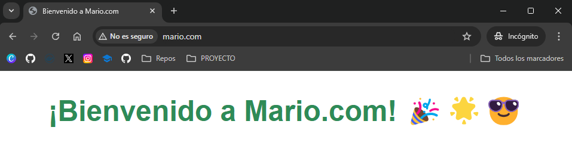
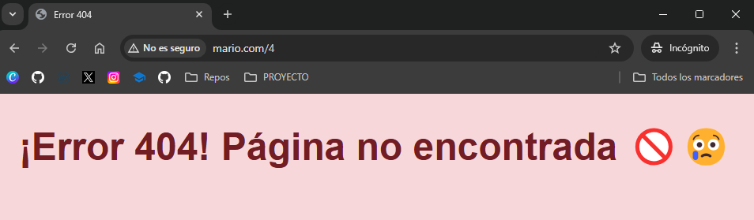


## WWW.DEDOMINGO.COM

Configurar el Hosts Virtual en `sites-available` del archivo `dedomingo.conf` :
```
server {
    listen 80; # Puerto por defecto para HTTP
    listen [::]:80; # Puerto por defecto para HTTP en IPv6

    server_name dedomingo.com www.dedomingo.com; # Nombre del dominio

    root /var/www/html/dedomingo.com; # Ruta de la carpeta raíz del dominio
    index index.html; # Archivo por defecto

    location / {
        try_files $uri $uri/ =404; # Intenta servir el archivo solicitado, si no existe, muestra un error 404
    }

    # Personalizar la página de error 404
    error_page 404 /404.html;
    location = /404.html {
        root /var/www/html/dedomingo.com/errors; # Ruta donde se encuentra el archivo de error
        internal; # Asegura que la página de error no sea accesible directamente
    }
}
```

En el archivo `entrypoint.sh` añadimos lo siguiente:
```
if [ ! -L /etc/nginx/sites-enabled/dedomingo.conf ]; then
  ln -s /etc/nginx/sites-available/dedomingo.conf /etc/nginx/sites-enabled/
fi
```

### RESULTADOS
`http://dedomingo.com`<br><br>
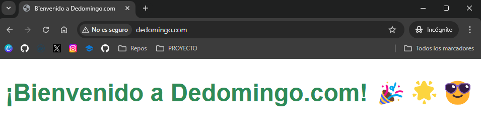
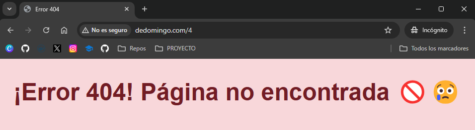

## SEGURO.NET

Configurar el Hosts Virtual en `sites-available` del archivo `seguro.conf` :
```
server {
	listen 80;
	listen [::]:80;

	server_name seguro.net;

	# Redirigir todo el tráfico HTTP a HTTPS
    return 301 https://$host$request_uri;

}

server {
    listen 443 ssl;
    server_name seguro.net www.seguro.net;

    ssl_certificate /etc/nginx/certs/seguro.crt;
    ssl_certificate_key /etc/nginx/certs/seguro.key;

    # Configuraciones SSL adicionales
    ssl_protocols TLSv1.2 TLSv1.3;
    ssl_ciphers 'EECDH+AESGCM:EDH+AESGCM:AES256+EECDH:AES256+EDH';
    ssl_prefer_server_ciphers on;

    # Ruta al directorio raíz del sitio
    root /var/www/html/seguro.net;
		index index.html;

    location / {
        try_files $uri $uri/ =404; # Intenta servir el archivo solicitado, si no existe, muestra un error 404
    }

    error_page 401 /401.html;
    location = /401.html {
        root /var/www/html/seguro.net/errors; # Ruta donde se encuentra el archivo de error
        internal; # Asegura que la página de error no sea accesible directamente
    }

    error_page 403 /403.html;
    location = /403.html {
        root /var/www/html/seguro.net/errors; # Ruta donde se encuentra el archivo de error
        internal; # Asegura que la página de error no sea accesible directamente
    }

    error_page 404 /404.html;
    location = /404.html {
        root /var/www/html/seguro.net/errors; # Ruta donde se encuentra el archivo de error
        internal; # Asegura que la página de error no sea accesible directamente
    }

    error_page 500 /500.html;
    location = /500.html {
        root /var/www/html/seguro.net/errors; # Ruta donde se encuentra el archivo de error
        internal; # Asegura que la página de error no sea accesible directamente
    }

	location /privado {
        auth_basic "Acceso Restringido";
        auth_basic_user_file /etc/nginx/.htpasswd;
	}
}
```

En el archivo `entrypoint.sh` añadimos lo siguiente:
```
if [ ! -L /etc/nginx/sites-enabled/seguro.conf ]; then
  ln -s /etc/nginx/sites-available/seguro.conf /etc/nginx/sites-enabled/
fi
```
### CREACIÓN DE CERTIFICADOS

Crearemos los certificados, para ello instalamos el programa OpenSSL.
Abrimos la terminal en la carpeta `certs` y ejecutamos el siguiente comando
```
openssl req -x509 -nodes -days 365 -newkey rsa:2048 -keyout seguro.key -out seguro.crt
```

Nos pedirá una serie de datos. Respondemos a los datos que pide y en el Common Name ponemos el nombre del webhost incluida la extensión `seguro.net`.<br>
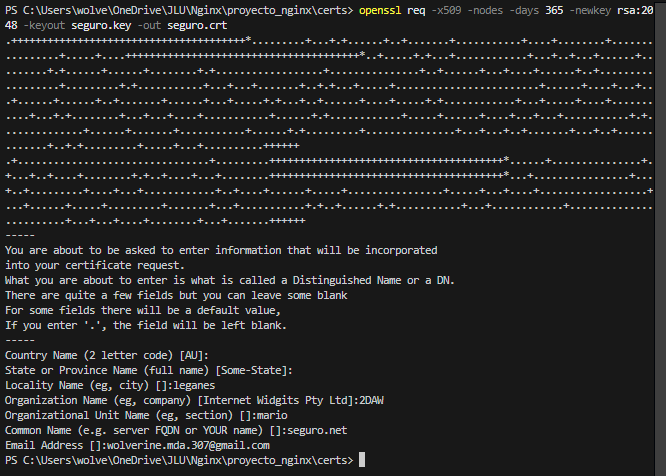

Al finalizar, se crearan los siguientes archivos en nuetro directorio `certs`:<br>
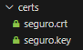

### CREACION .htpasswd
Generamos archivo `.htpasswd` con el usuario y contraseña que deseemos.

Una vez dentro de la terminal de Nginx, iremos a la ruta `/etc/nginx.`

Con el comando `ls -a` vemos los archivos ocultos y podemos ver que existe el archivo `.htpasswd`.

Antes deberemos usar este comando para instalar las caracteristicas de Apache:
```
apt update && apt install apache2-utils
```
Generamos el archivo con el siguiente comando:
```
htpasswd -c /etc/nginx/.htpasswd mario
```

```
htpasswd/
└── entrypoints.sh
```

### RESULTADOS
`http://seguro.net`<br><br>
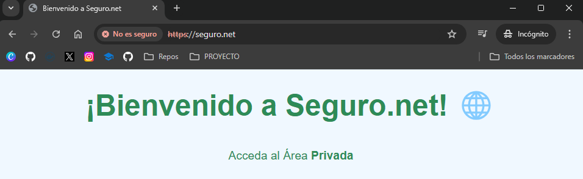
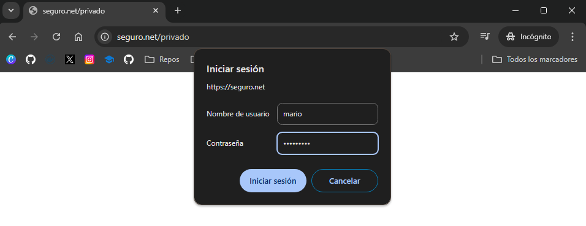
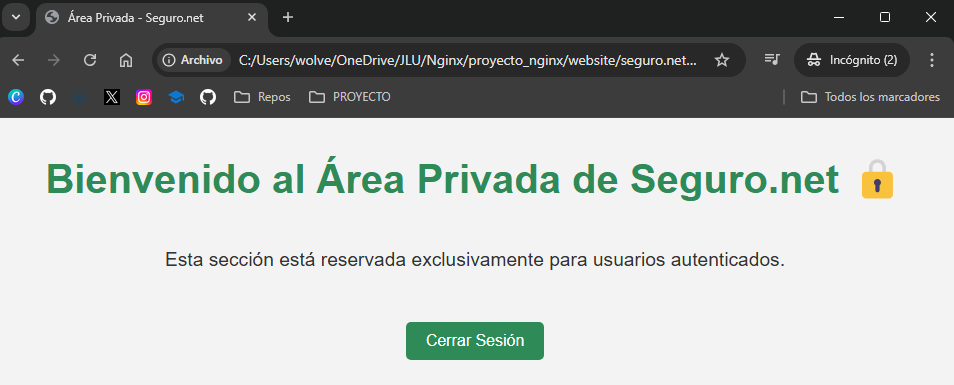
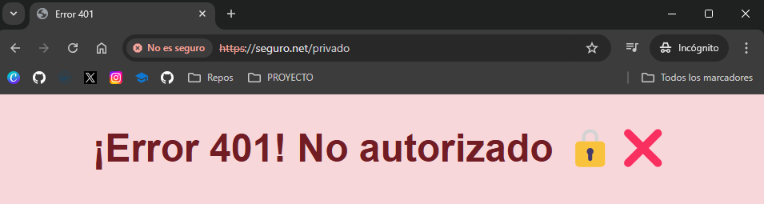
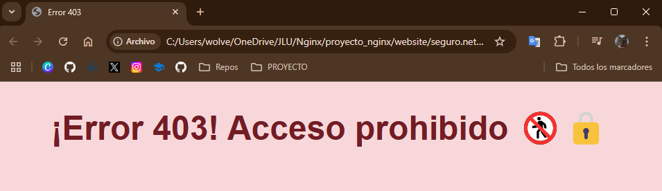
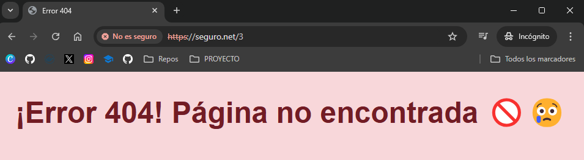
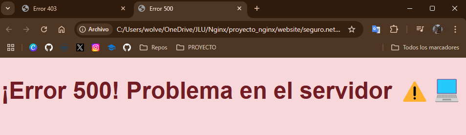

## LANZAMIENTO DEL DOCKER COMPOSE Y COMANDOS USADOS

Construimos (build) y levantamos (up) los contenedores en segundo plano usando `docker-compose.yml`:
```
docker-compose --build -d
```

Levantamos  todos los contenedores definidos en docker-compose.yml en segundo plano:
```
docker-compose up -d
```

Detiene y elimina todos los contenedores, redes y volúmenes creados por `docker-compose up`:
```
docker-compose down
```

Para acceder a la terminal del servidor generado:
```
docker exec -it nginx_server /bin/bash
```

Detiene el contenedor llamado `nginx_server`:
```
docker stop nginx_server
```

 Muestra los registros de salida del contenedor `nginx_server` para buscar los errores si los hubiera:
```
docker logs nginx_server
```

Cada vez que modifiquemos algún archivo de configuración, debemos eliminar y volver a generar los contenedores para aplicar la nueva configuración.